<!-- @import "[TOC]" {cmd="toc" depthFrom=1 depthTo=6 orderedList=false} -->
<!-- code_chunk_output -->

* [1.3 Android/iOS](#13-androidios)
	* [1.3.1 Android root](#131-android-root)
		* [1.3.1.1 硬件准备](#1311-硬件准备)
		* [1.3.1.2 刷入官方`Android 8.1`](#1312-刷入官方android-81)
		* [1.3.1.3 刷入`twrp recovery`](#1313-刷入twrp-recovery)
		* [1.3.1.4 刷入`Magisk`](#1314-刷入magisk)
		* [1.3.1.5 获取`root`权限](#1315-获取root权限)
	* [1.3.2 Android frida-server 安装](#132-android-frida-server-安装)

<!-- /code_chunk_output -->


### 1.3 Android/iOS

#### 1.3.1 Android root

##### 1.3.1.1 硬件准备

在手机硬件的考虑上，首先优选谷歌的“亲儿子”：`Nexus`和`Pixel`系列，鉴于官网上测试案例在`Nexus 5X`手机，系统为`Android 8.1.0`版本上进行测试，我们也会选用这款手机、和这个系统版本来进行实验。

官网也指出不可能在所有手机和所有ROM上完全进行测试，肯定是具体情况具体分析。

>Also note that most of our recent testing has been taking place on a Nexus 5X running Android 8.1.0. Older and newer ROMs may work, but if you’re running into basic issues like Frida crashing the system when launching an app, this is due to ROM-specific quirks. We cannot test on all possible devices, so we count on your help to improve on this. However if you’re just starting out with Frida it is strongly recommended to go with a Nexus device with factory software, or an official 8.x emulator image for arm or arm64. (x86 may work too but has gone through significantly less testing.)

官网上依旧指出，选择`Android 8.x`系统的模拟器也是没问题的，架构必须选择`arm`或者`arm64`，`x86`可能会有`crash`的情况发生。

`Nexus 5X`这款手机的硬件参数为：

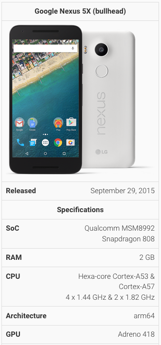
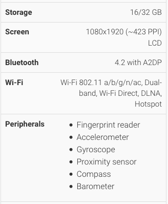

##### 1.3.1.2 刷入官方`Android 8.1`

frida官网指出的`factory software`就是谷歌的[官方工厂镜像网站](https://developers.google.com/android/images)，打开这个网站可能需要科学上网。网站中间有一些操作指南，右边就是手机型号一览表，在这里我们选择`Nexus 5X`的型号`bullhead`。

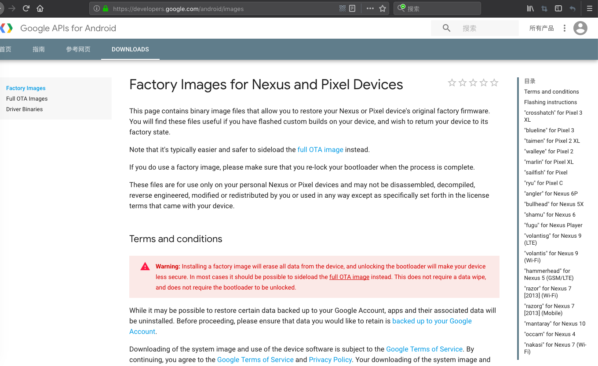

可以看到从安卓6到安卓8均支持，而且最新支持到`8.1.0`。

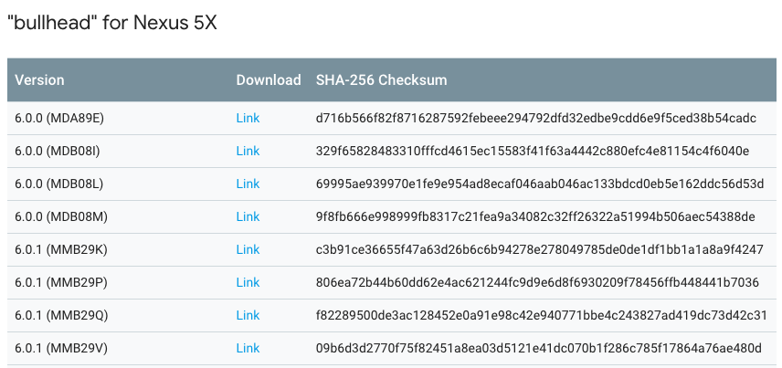
...
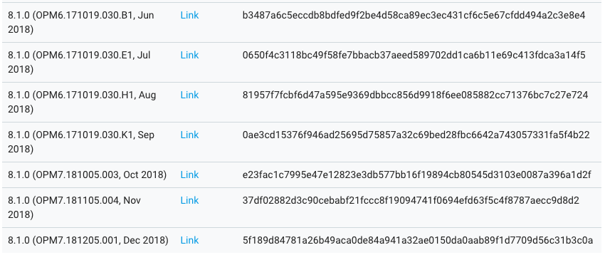

我们使用`wget`命令来下载最新的`8.1.0 (OPM7.181205.001, Dec 2018)`版本，这样速度最快。

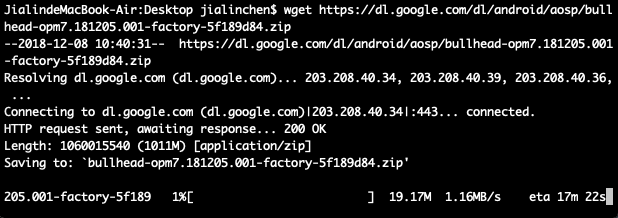

下载完成后记得校验`SHA-256 Checksum`，必须得于官网一致，否则下载文件已经损坏，无法使用，必须重新下载。

```
$ openssl dgst -sha256 bullhead-opm7.181205.001-factory-5f189d84.zip
SHA256(bullhead-opm7.181205.001-factory-5f189d84.zip)= 5f189d84781a26b49aca0de84a941a32ae0150da0aab89f1d7709d56c31b3c0a
```

可见`SHA-256 Checksum`与官网相同，接下来就是刷入该系统。

首先将手机进入`fastboot`状态，操作流程如下：

1. 将`USB`线断开，并确保手机有`80%`左右的电量；
2. 将手机完全关机；
3. 同时按住音量向下键和开机键；
4. 手机将进入`fastboot`状态；

状态如下：

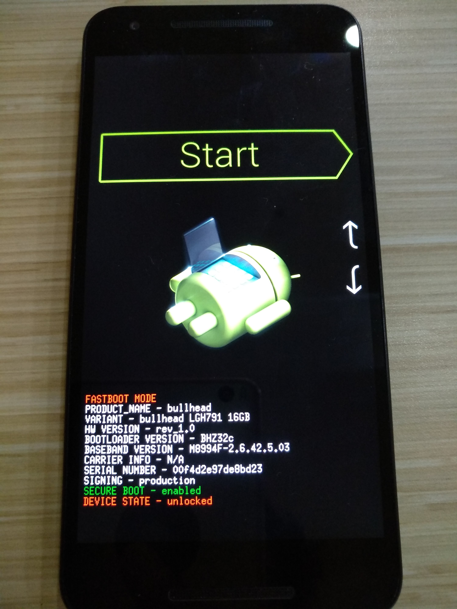

>PS：如果手机并没有解锁，也就是`DEVICE STATE - `显示`locked`，那手机需要先解锁，得是`unlocked`，也就是图上的状态，才可以后续刷入`recovery`等操作。`Nexus 5X`手机解锁是比较简单的，这里不做演示了。

手机用USB线连上电脑，运行脚本，将系统刷进手机。

```
$ unzip bullhead-opm7.181205.001-factory-5f189d84.zip
Archive:  bullhead-opm7.181205.001-factory-5f189d84.zip
   creating: bullhead-opm7.181205.001/
  inflating: bullhead-opm7.181205.001/radio-bullhead-m8994f-2.6.42.5.03.img
  inflating: bullhead-opm7.181205.001/bootloader-bullhead-bhz32c.img
  inflating: bullhead-opm7.181205.001/flash-all.bat
  inflating: bullhead-opm7.181205.001/flash-all.sh
 extracting: bullhead-opm7.181205.001/image-bullhead-opm7.181205.001.zip
  inflating: bullhead-opm7.181205.001/flash-base.sh
$ cd bullhead-opm7.181205.001
$ ./flash-all.sh
target reported max download size of 536870912 bytes
sending 'bootloader' (4610 KB)...
OKAY [  0.197s]
writing 'bootloader'...
OKAY [  0.174s]
finished. total time: 0.371s
rebooting into bootloader...
OKAY [  0.020s]
finished. total time: 0.020s
target reported max download size of 536870912 bytes
sending 'radio' (56630 KB)...
OKAY [  1.629s]
writing 'radio'...
OKAY [  0.917s]
finished. total time: 2.546s
rebooting into bootloader...
OKAY [  0.020s]
finished. total time: 0.020s
extracting android-info.txt (0 MB) to RAM...
extracting boot.img (11 MB) to disk... took 0.125s
target reported max download size of 536870912 bytes
archive does not contain 'boot.sig'
archive does not contain 'dtbo.img'
archive does not contain 'dt.img'
extracting recovery.img (17 MB) to disk... took 0.093s
archive does not contain 'recovery.sig'
extracting system.img (1909 MB) to disk... took 17.733s
archive does not contain 'system.sig'
archive does not contain 'vbmeta.img'
extracting vendor.img (185 MB) to disk... took 1.895s
archive does not contain 'vendor.sig'
wiping userdata...
mke2fs 1.43.3 (04-Sep-2016)
Creating filesystem with 2874363 4k blocks and 719488 inodes
Filesystem UUID: 79218aab-c322-4823-a83f-5a26ad3fd27e
Superblock backups stored on blocks:
	32768, 98304, 163840, 229376, 294912, 819200, 884736, 1605632, 2654208

Allocating group tables: done
Writing inode tables: done
Creating journal (16384 blocks): done
Writing superblocks and filesystem accounting information: done

wiping cache...
mke2fs 1.43.3 (04-Sep-2016)
Creating filesystem with 24576 4k blocks and 24576 inodes

Allocating group tables: done
Writing inode tables: done
Creating journal (1024 blocks): done
Writing superblocks and filesystem accounting information: done

--------------------------------------------
Bootloader Version...: BHZ32c
Baseband Version.....: M8994F-2.6.42.5.03
Serial Number........: 00f4d2e97de8bd23
--------------------------------------------
checking product...
OKAY [  0.020s]
checking version-bootloader...
OKAY [  0.020s]
checking version-baseband...
OKAY [  0.020s]
sending 'boot' (11781 KB)...
OKAY [  0.358s]
writing 'boot'...
OKAY [  0.192s]
sending 'recovery' (17425 KB)...
OKAY [  0.519s]
writing 'recovery'...
OKAY [  0.294s]
erasing 'system'...
OKAY [  0.452s]
sending sparse 'system' 1/4 (508768 KB)...
OKAY [ 14.932s]
writing 'system' 1/4...
OKAY [  9.061s]
sending sparse 'system' 2/4 (524238 KB)...
OKAY [ 15.055s]
writing 'system' 2/4...
OKAY [  9.168s]
sending sparse 'system' 3/4 (501061 KB)...
OKAY [ 15.391s]
writing 'system' 3/4...
OKAY [  9.779s]
sending sparse 'system' 4/4 (421469 KB)...
OKAY [ 12.113s]
writing 'system' 4/4...
OKAY [  7.220s]
erasing 'vendor'...
OKAY [  0.110s]
sending 'vendor' (190332 KB)...
OKAY [  5.327s]
writing 'vendor'...
OKAY [  3.776s]
erasing 'userdata'...
OKAY [  0.758s]
sending 'userdata' (4284 KB)...
OKAY [  0.199s]
writing 'userdata'...
OKAY [  0.104s]
erasing 'cache'...
OKAY [  0.077s]
sending 'cache' (92 KB)...
OKAY [  0.082s]
writing 'cache'...
OKAY [  0.020s]
rebooting...

finished. total time: 105.131s

```

刷机完成后，手机会自动重启，重启完成后即可自动进入系统。


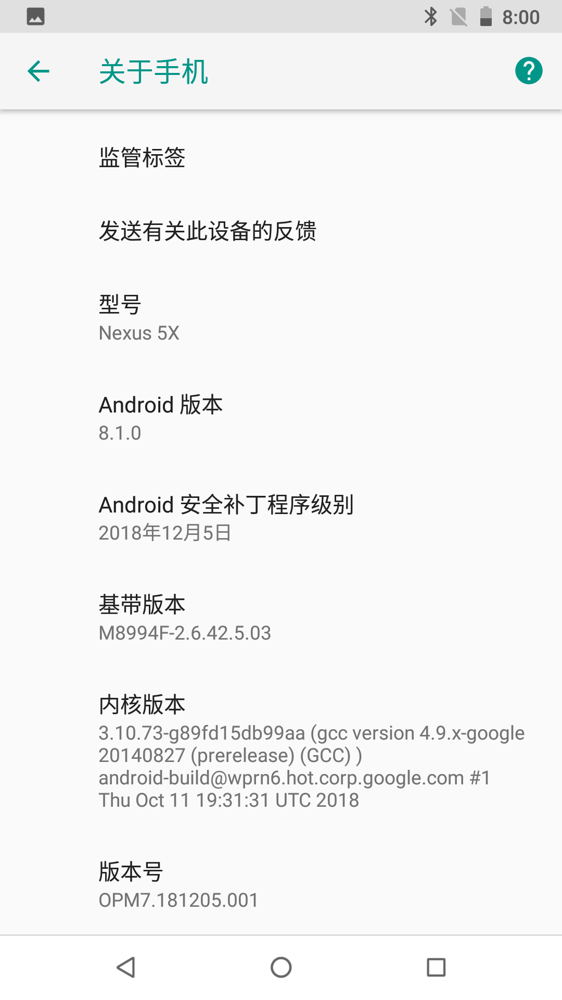

##### 1.3.1.3 刷入`twrp recovery`

`recovery`相当于`Windows PE`微型系统，在`recovery`里我们也可以挂载磁盘，修改系统分区，使用`adb`命令，等一系列功能。详细的功能列表可以百度或者谷歌。

我们这里只需要下载`twrp`针对`bullhead`机型的镜像，刷进去即可。

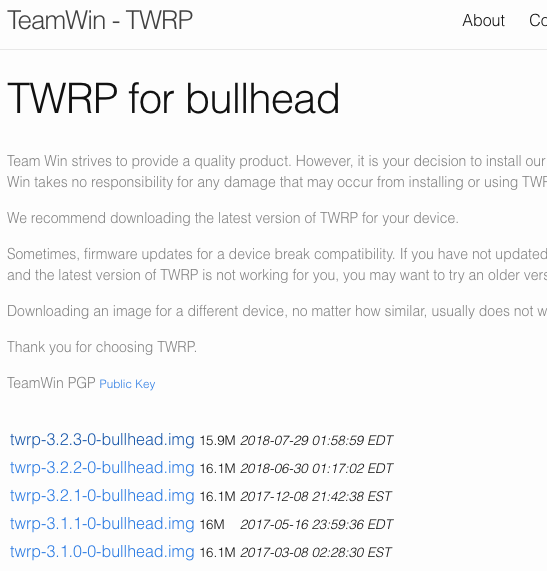

我们下载最新的`twrp-3.2.3-0-bullhead.img`镜像文件。

然后将手机设置到`fastboot`模式，使用`fastboot`命令将镜像刷进去。

```
$ fastboot flash recovery twrp-3.2.3-0-bullhead.img
target reported max download size of 536870912 bytes
sending 'recovery' (16289 KB)...
OKAY [  0.499s]
writing 'recovery'...
OKAY [  0.275s]
finished. total time: 0.774s
```

刷完之后，在手机上按两次音量向下键，选择`Recovery mode`，按电源键进入。

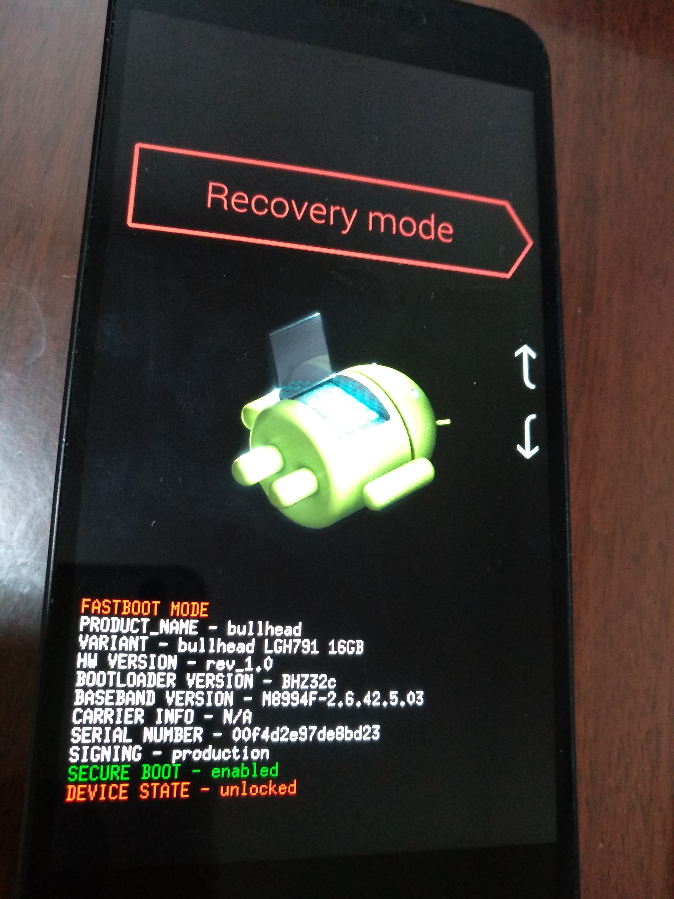

稍等片刻之后，就会进入`twrp 3.2.3-0`系统。

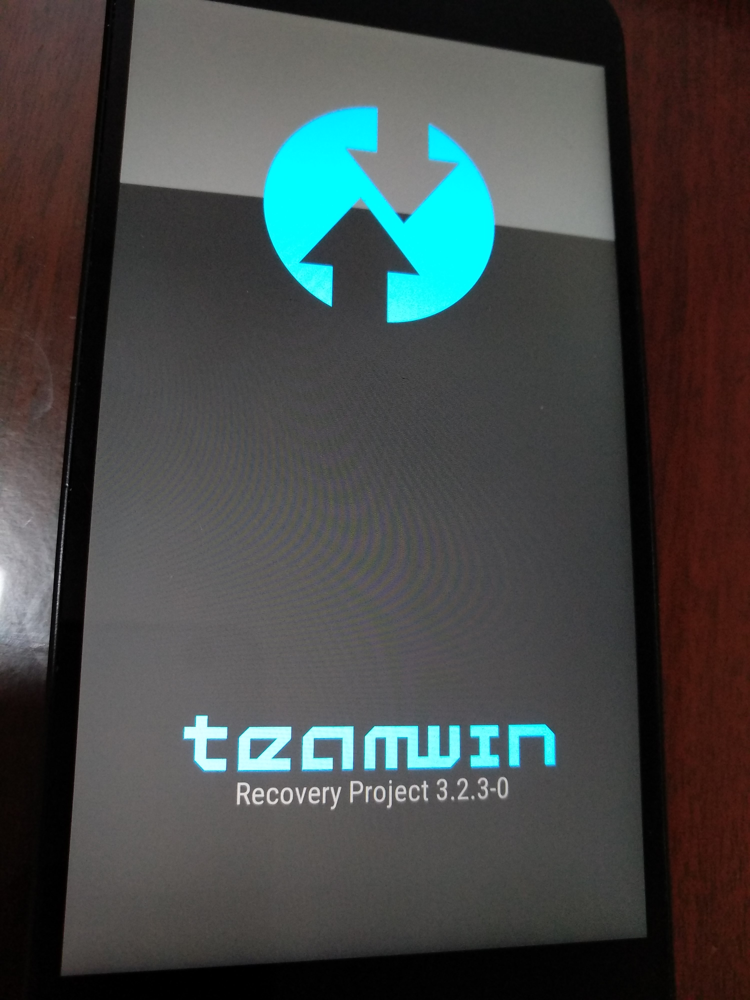

直接滑开即可。意味着允许修改系统。

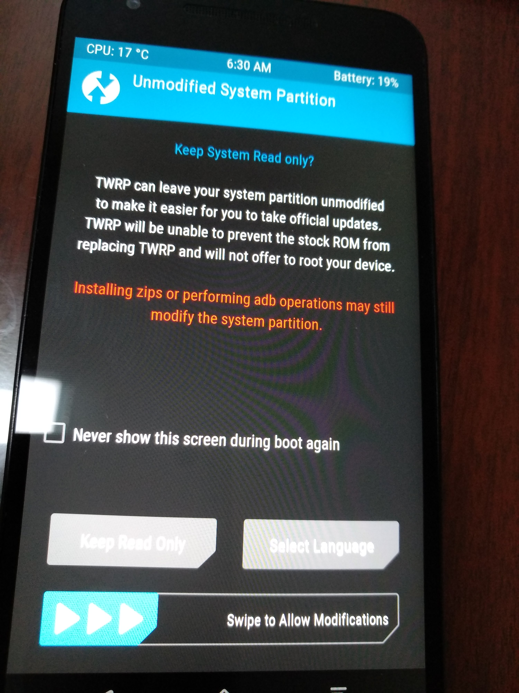

可以看到功能非常丰富。

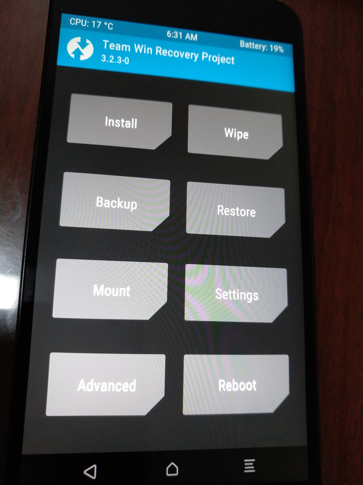

##### 1.3.1.4 刷入`Magisk`

自从`SuperSU`卖给中国人，并且不再更新之后，大家已经不怎么使用这款`root`软件了，取而代之的是`Magisk`。

`Magisk`是由中国台湾省小伙儿`topjohnwu`开发的一款完全开源的`root`软件，其`github`项目托管主页在[这里](https://github.com/topjohnwu/Magisk)。

有关`Magisk`的详细中文介绍，大家可以看[这篇文章](https://xposed.appkg.com/2536.html)，我们只是用`Magisk`来获取`root`权限。

在`github`项目主页的`release`页面，下载最新的卡刷包：`Magisk-v17.3.zip`

然后使用`adb`命令将卡刷包上传到手机中去。

```
$ adb push Magisk-v17.3.zip /sdcard/
* daemon not running; starting now at tcp:5037
* daemon started successfully
Magisk-v17.3.zip: 1 file pushed. 6.5 MB/s (4178628 bytes in 0.610s)
```

然后使用`twrp`将这个卡刷包安装进手机里。首先点选上一节最后一张图中的`Install`。

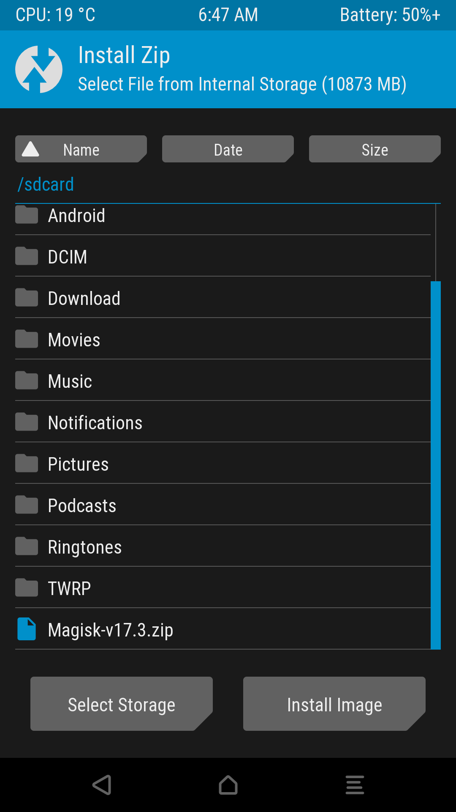

然后选择我们刚刚传输进去的`Magisk-v17.3.zip`卡刷包。

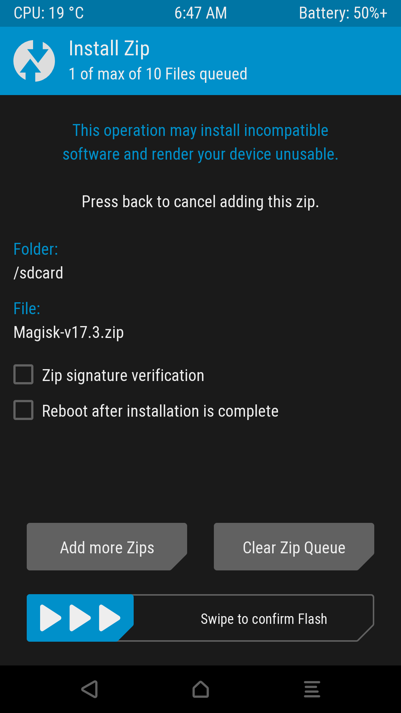

滑动确认安装。

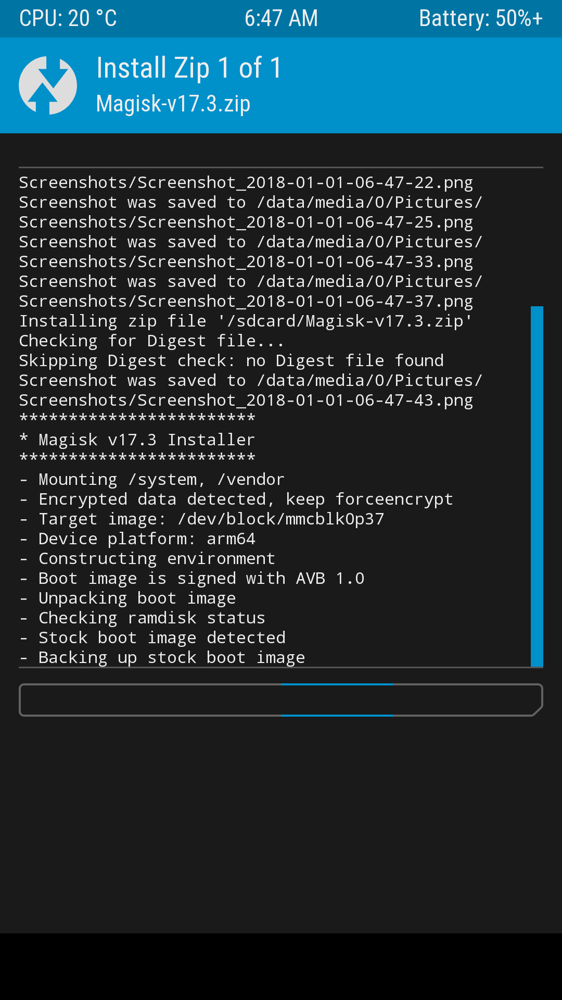

安装完成后直接重启即可，`Reboot System`

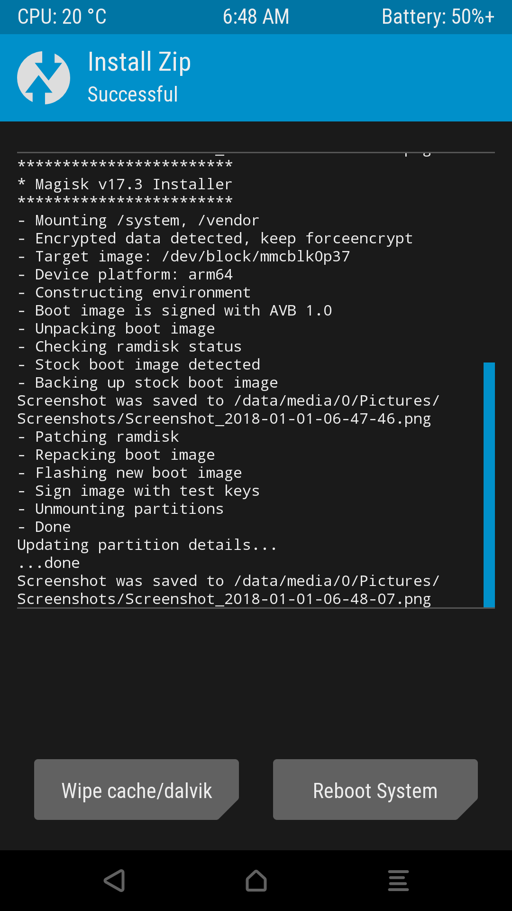

滑动重启。

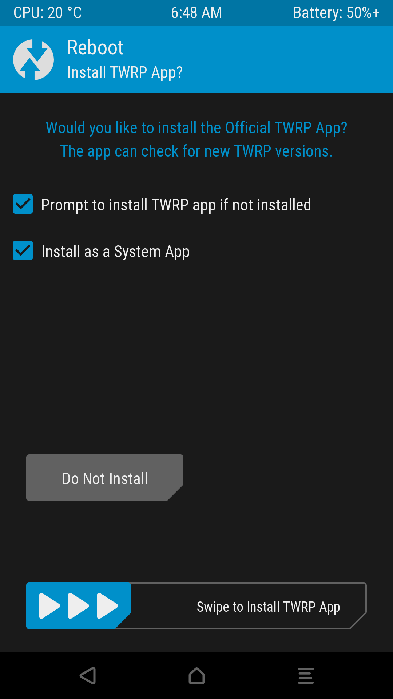

重启后发现`Magisk Manager`已经安装好了，并且是作为系统App，卸载不了的。卸载只有安装官网`release`页面里的`Magisk-uninstaller-20181022.zip`卡刷包。

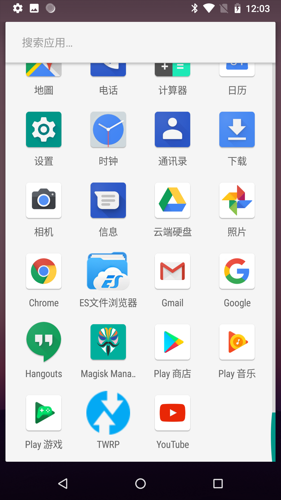

打开`App`可以看到安装成功。

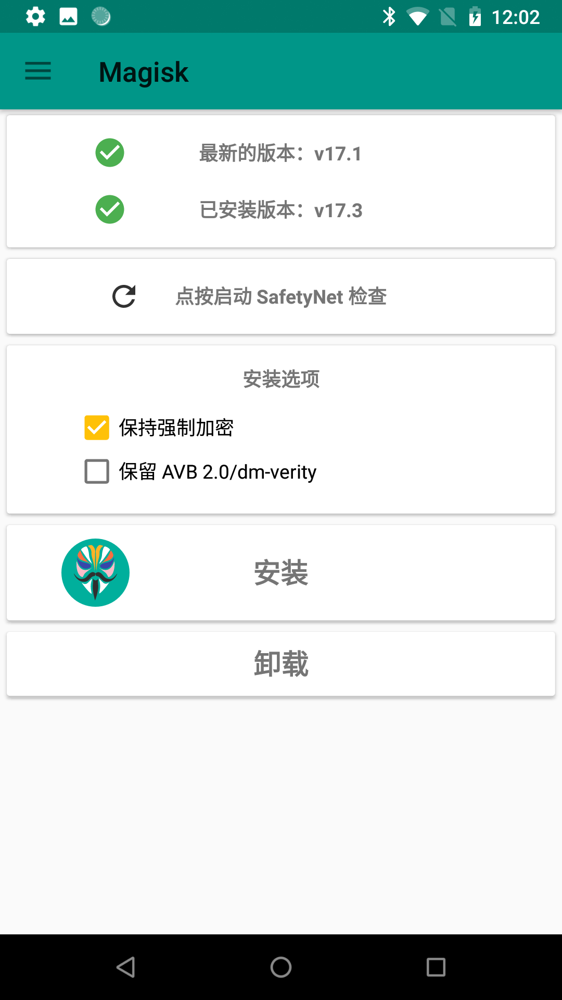

##### 1.3.1.5 获取`root`权限

接下来就是使用`adb`命令进入安卓手机的`shell`，并且获取`root`权限，为下一节做好准备。

在手机上找到`设置→系统→关于手机→版本号`，点击`版本号`五下，打开`开发者选项`，然后进入`设置→系统→开发者选项`，打开`USB调试选项`。然后USB连接到电脑，使用`adb`命令连上去。手机上会出现授权，点击接受该指纹的电脑连接。

```
$ adb shell
bullhead:/ $
bullhead:/ $
bullhead:/ $ whoami
shell
bullhead:/ $
```

此时是`shell`权限，权限非常小。我们来切换到`root`用户：

```
bullhead:/ $ su -
```

此时手机上会出现`Magisk`的超级用户请求，点击允许，`com.android.shell`即可获取`root`权限。

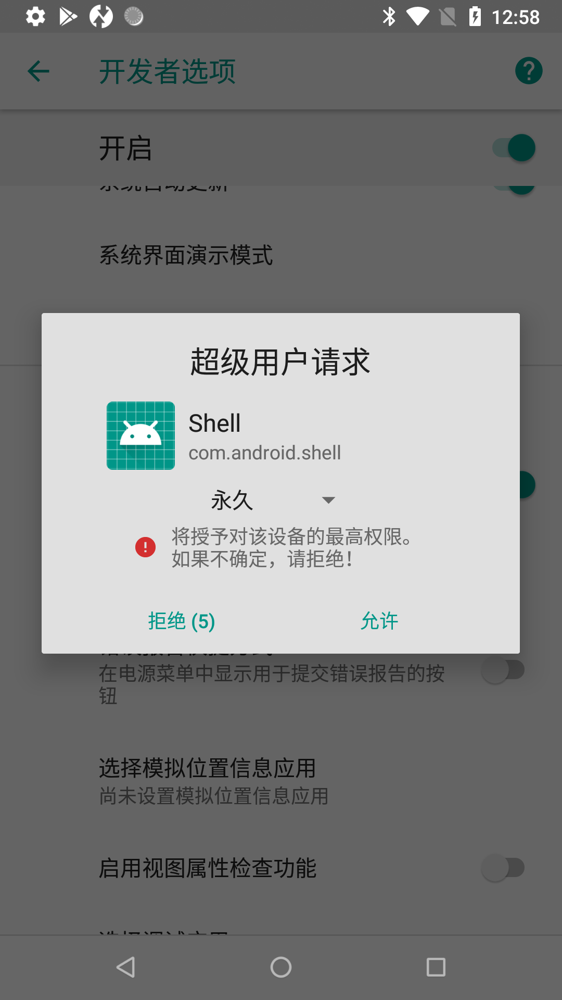

点击允许之后，`su -`这个命令才会返回，然后运行`whoami`命令，可以看到已经是`root`了。

```
bullhead:/ #
bullhead:/ # whoami
root
bullhead:/ #
bullhead:/ #
```

这时候就可以用`root`的权限来做一些事情了。

#### 1.3.2 Android frida-server 安装

上一节中刷机，获取`root`其实倒是蛮复杂的，这一节安装`frida-server`其实倒是简单很多，我们从官方github页面的`release`标签里，找到最新版的`frida-server`，注意要匹配系统和架构，比如`arm`和`arm64`就不能搞错，比如我们这里选择的就是`frida-server-12.2.26-android-arm64.xz`的版本。

下载完成后进行解压，获得`linux`原生的可执行文件，我们将它重命名为`frida-server`。

```
$ file frida-server
frida-server-arm64: ELF 64-bit LSB shared object ARM aarch64, version 1 (SYSV), dynamically linked, interpreter /system/bin/linker64, stripped
```

使用`adb`命令将其推送到手机上去。

```
$ adb push frida-server /data/local/tmp/
```

然后使用`adb shell`命令进入到手机中去，执行以下命令：

```
$ adb shell
bullhead:/ $ su -
bullhead:/ # whoami
root
bullhead:/ # cd /data/local/tmp/
bullhead:/data/local/tmp # chmod 755 /data/local/tmp/frida-server
bullhead:/data/local/tmp # ./frida-server &
[1] 9849
bullhead:/data/local/tmp #
```

`frida-server`即可运行成功。

此时在电脑上新开一个`shell`，运行`frida-ps -U`命令，即可显示手机中正在运行的进程。

```
$ frida-ps -U
 PID  Name
----  ---------------------------------------------------
9628  -
5389  .esfm
 591  ATFWD-daemon
2953  adbd
 596  android.hardware.biometrics.fingerprint@2.1-service
 398  android.hardware.cas@1.0-service
 399  android.hardware.configstore@1.0-service
 400  android.hardware.dumpstate@1.0-service.bullhead
 401  android.hardware.graphics.allocator@2.0-service
 402  android.hardware.usb@1.0-service
 403  android.hardware.wifi@1.0-service
 397  android.hidl.allocator@1.0-service
7456  android.process.acore
3098  android.process.media
 567  audioserver
 568  cameraserver
 592  cnd
 588  cnss-daemon
 977  com.android.bluetooth
8829  com.android.connectivity.metrics
8275  com.android.keychain
3026  com.android.nfc
1175  com.android.phone
5184  com.android.settings
1020  com.android.systemui
7414  com.android.vending
3417  com.estrongs.android.pop
8247  com.estrongs.android.pop:local
5916  com.google.android.apps.gcs
8711  com.google.android.apps.messaging
8747  com.google.android.apps.messaging:rcs
7721  com.google.android.apps.photos
```

到这里我们在64位手机`Nexus 5X`的安卓原生`8.1`系统上安装`frida-server`就成功了。
